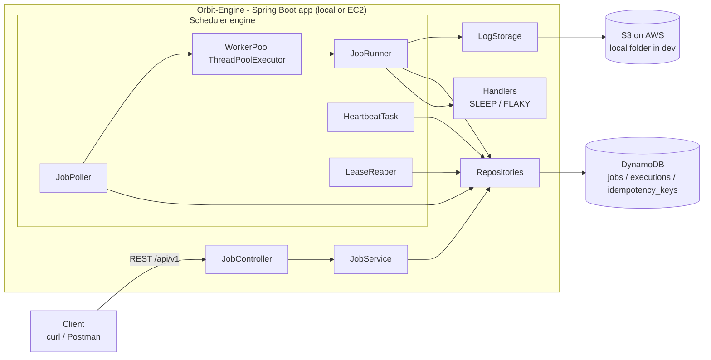

# HLD: Components

```mermaid
flowchart LR
    Client["Client<br/>curl / Postman"] -->|"REST /api/v1"| API

    subgraph App["Orbit-Engine - Spring Boot app (local or EC2)"]
        API["JobController"] --> SVC["JobService"]
        SVC --> REPO["Repositories"]

        subgraph Engine["Scheduler engine"]
            POLL["JobPoller"]
            POOL["WorkerPool<br/>ThreadPoolExecutor"]
            RUN["JobRunner"]
            HB["HeartbeatTask"]
            REAP["LeaseReaper"]
        end

        POLL --> REPO
        POLL --> POOL
        POOL --> RUN
        RUN --> HAND["Handlers<br/>SLEEP / FLAKY"]
        RUN --> REPO
        RUN --> LOG["LogStorage"]
        HB --> REPO
        REAP --> REPO
    end

    REPO --> DDB[("DynamoDB<br/>jobs / executions / idempotency_keys")]
    LOG --> STORE[("S3 on AWS<br/>local folder in dev")]
```
