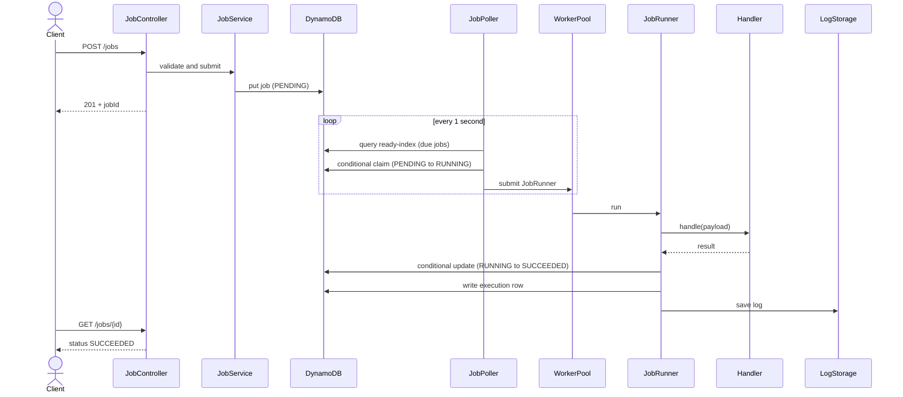

# HLD: Job lifecycle (happy path)

```mermaid
sequenceDiagram
    actor C as Client
    participant API as JobController
    participant S as JobService
    participant D as DynamoDB
    participant P as JobPoller
    participant W as WorkerPool
    participant R as JobRunner
    participant H as Handler
    participant L as LogStorage

    C->>API: POST /jobs
    API->>S: validate and submit
    S->>D: put job (PENDING)
    API-->>C: 201 + jobId

    loop every 1 second
        P->>D: query ready-index (due jobs)
        P->>D: conditional claim (PENDING to RUNNING)
        P->>W: submit JobRunner
    end

    W->>R: run
    R->>H: handle(payload)
    H-->>R: result
    R->>D: conditional update (RUNNING to SUCCEEDED)
    R->>D: write execution row
    R->>L: save log

    C->>API: GET /jobs/{id}
    API-->>C: status SUCCEEDED
```
