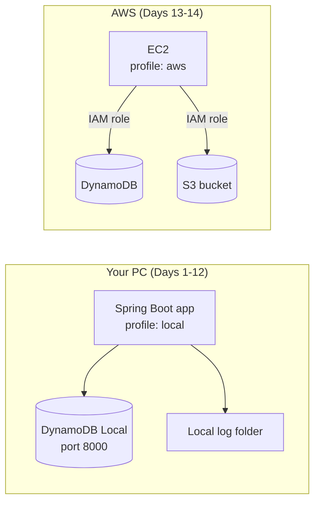

# HLD: Deployment

```mermaid
flowchart LR
    subgraph Dev["Your PC (Days 1-12)"]
        A1["Spring Boot app<br/>profile: local"] --> A2[("DynamoDB Local<br/>port 8000")]
        A1 --> A3["Local log folder"]
    end
    subgraph AWS["AWS (Days 13-14)"]
        B1["EC2<br/>profile: aws"] -->|"IAM role"| B2[("DynamoDB")]
        B1 -->|"IAM role"| B3[("S3 bucket")]
    end
```
