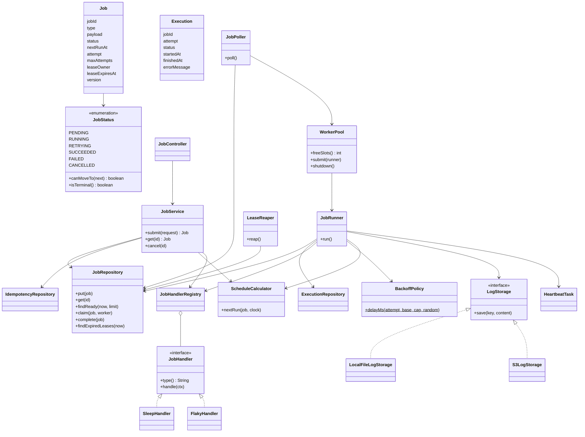

# LLD: Classes

```mermaid
classDiagram
    class JobStatus {
        <<enumeration>>
        PENDING
        RUNNING
        RETRYING
        SUCCEEDED
        FAILED
        CANCELLED
        +canMoveTo(next) boolean
        +isTerminal() boolean
    }
    class Job {
        jobId
        type
        payload
        status
        nextRunAt
        attempt
        maxAttempts
        leaseOwner
        leaseExpiresAt
        version
    }
    class Execution {
        jobId
        attempt
        status
        startedAt
        finishedAt
        errorMessage
    }
    class JobController
    class JobService {
        +submit(request) Job
        +get(id) Job
        +cancel(id)
    }
    class JobRepository {
        +put(job)
        +get(id)
        +findReady(now, limit)
        +claim(job, worker)
        +complete(job)
        +findExpiredLeases(now)
    }
    class ExecutionRepository
    class IdempotencyRepository
    class JobPoller {
        +poll()
    }
    class WorkerPool {
        +freeSlots() int
        +submit(runner)
        +shutdown()
    }
    class JobRunner {
        +run()
    }
    class HeartbeatTask
    class LeaseReaper {
        +reap()
    }
    class BackoffPolicy {
        +delayMs(attempt, base, cap, random)$
    }
    class ScheduleCalculator {
        +nextRun(job, clock)
    }
    class JobHandler {
        <<interface>>
        +type() String
        +handle(ctx)
    }
    class SleepHandler
    class FlakyHandler
    class JobHandlerRegistry
    class LogStorage {
        <<interface>>
        +save(key, content)
    }
    class LocalFileLogStorage
    class S3LogStorage

    JobController --> JobService
    JobService --> JobRepository
    JobService --> IdempotencyRepository
    JobService --> ScheduleCalculator
    JobService --> JobHandlerRegistry
    JobPoller --> JobRepository
    JobPoller --> WorkerPool
    WorkerPool --> JobRunner
    JobRunner --> JobRepository
    JobRunner --> ExecutionRepository
    JobRunner --> JobHandlerRegistry
    JobRunner --> BackoffPolicy
    JobRunner --> ScheduleCalculator
    JobRunner --> LogStorage
    JobRunner --> HeartbeatTask
    LeaseReaper --> JobRepository
    JobHandlerRegistry o-- JobHandler
    JobHandler <|.. SleepHandler
    JobHandler <|.. FlakyHandler
    LogStorage <|.. LocalFileLogStorage
    LogStorage <|.. S3LogStorage
    Job --> JobStatus
```
