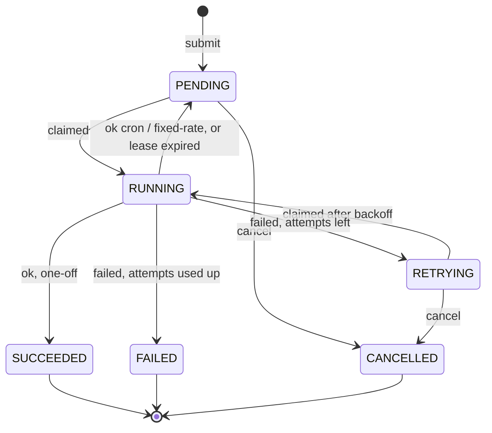

# LLD: Job state machine

```mermaid
stateDiagram-v2
    [*] --> PENDING: submit
    PENDING --> RUNNING: claimed
    PENDING --> CANCELLED: cancel
    RETRYING --> RUNNING: claimed after backoff
    RETRYING --> CANCELLED: cancel
    RUNNING --> SUCCEEDED: ok, one-off
    RUNNING --> PENDING: ok cron / fixed-rate, or lease expired
    RUNNING --> RETRYING: failed, attempts left
    RUNNING --> FAILED: failed, attempts used up
    SUCCEEDED --> [*]
    FAILED --> [*]
    CANCELLED --> [*]
```
