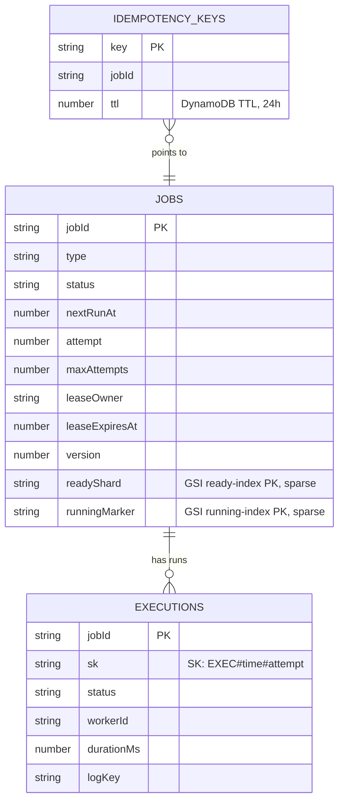

# LLD: DynamoDB data model

```mermaid
erDiagram
    JOBS ||--o{ EXECUTIONS : "has runs"
    IDEMPOTENCY_KEYS }o--|| JOBS : "points to"

    JOBS {
        string jobId PK
        string type
        string status
        number nextRunAt
        number attempt
        number maxAttempts
        string leaseOwner
        number leaseExpiresAt
        number version
        string readyShard "GSI ready-index PK, sparse"
        string runningMarker "GSI running-index PK, sparse"
    }
    EXECUTIONS {
        string jobId PK
        string sk "SK: EXEC#time#attempt"
        string status
        string workerId
        number durationMs
        string logKey
    }
    IDEMPOTENCY_KEYS {
        string key PK
        string jobId
        number ttl "DynamoDB TTL, 24h"
    }
```
