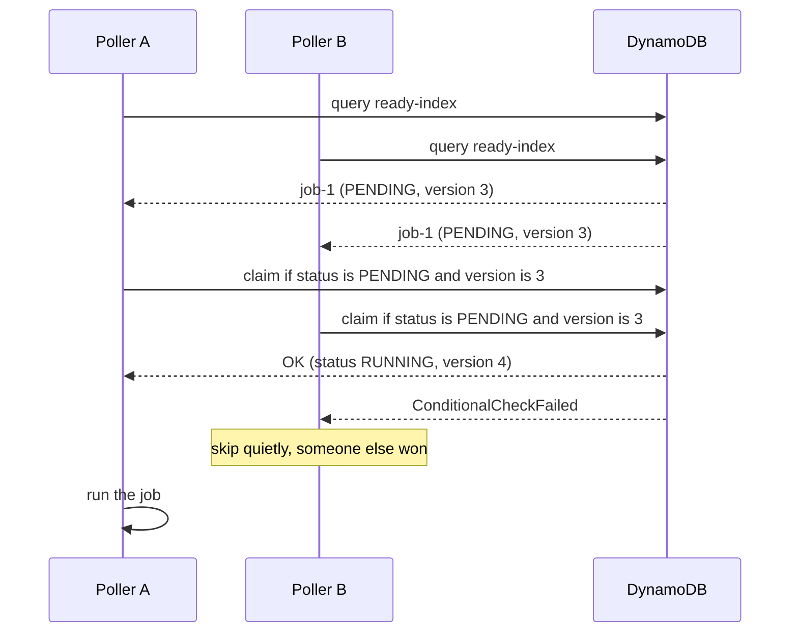

# LLD: Why two pollers never run the same job

```mermaid
sequenceDiagram
    participant A as Poller A
    participant B as Poller B
    participant D as DynamoDB

    A->>D: query ready-index
    B->>D: query ready-index
    D-->>A: job-1 (PENDING, version 3)
    D-->>B: job-1 (PENDING, version 3)
    A->>D: claim if status is PENDING and version is 3
    B->>D: claim if status is PENDING and version is 3
    D-->>A: OK (status RUNNING, version 4)
    D-->>B: ConditionalCheckFailed
    Note over B: skip quietly, someone else won
    A->>A: run the job
```
