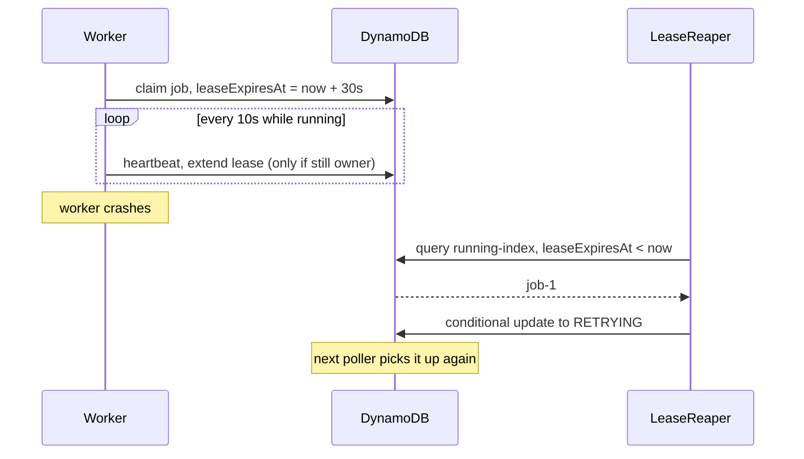

# LLD: Crash recovery (lease, heartbeat, reaper)

```mermaid
sequenceDiagram
    participant W as Worker
    participant D as DynamoDB
    participant R as LeaseReaper

    W->>D: claim job, leaseExpiresAt = now + 30s
    loop every 10s while running
        W->>D: heartbeat, extend lease (only if still owner)
    end
    Note over W: worker crashes
    R->>D: query running-index, leaseExpiresAt < now
    D-->>R: job-1
    R->>D: conditional update to RETRYING
    Note over D: next poller picks it up again
```
