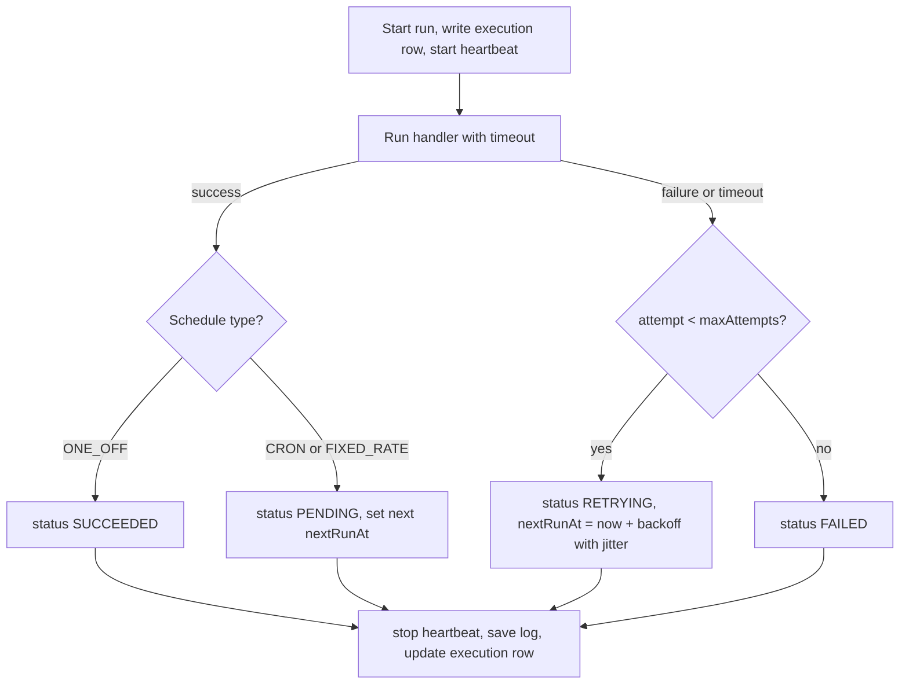

# LLD: What JobRunner does with the result

```mermaid
flowchart TD
    S["Start run, write execution row, start heartbeat"] --> H["Run handler with timeout"]
    H -->|success| T{"Schedule type?"}
    T -->|ONE_OFF| OK["status SUCCEEDED"]
    T -->|CRON or FIXED_RATE| NX["status PENDING, set next nextRunAt"]
    H -->|"failure or timeout"| A{"attempt < maxAttempts?"}
    A -->|yes| RT["status RETRYING, nextRunAt = now + backoff with jitter"]
    A -->|no| FL["status FAILED"]
    OK --> E["stop heartbeat, save log, update execution row"]
    NX --> E
    RT --> E
    FL --> E
```
